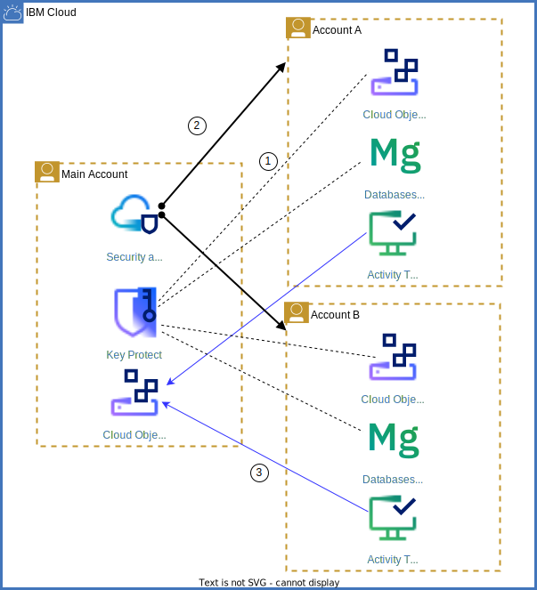

# Sharing resources across IBM Cloud accounts
This repository includes code samples and additional material related to the IBM Cloud solution tutorial on resource sharing across accounts.

### Sharing security-related resources

The diagram shows the following scenarios:

1. Instances of Object Storage and Databases for MongoDB in Account A and Account B utilize encryption keys managed in the Main Account in Key Protect.
2. Security and Compliance Center in the Main Account governs resources in all three accounts (see black lines above).
3. Instances of Activity Tracker in Account A and Account B direct security logs with Activity Tracker Event Routing to Object Storage buckets in the Main Account (see blue lines above).

This kind of sharing can be done independently of having an IBM Cloud Enterprise account or not.

### Sample Terraform configurations
- **Multi-account access**: [Configure multi-account access using aliases](terraform-multiaccount)
- **Service to service authorization across accounts**: [Service to service authorization for Cloud Object Storage to Key Protect](/terraform-services/authorization-policy.tf)
- **Activity Tracker event routing**: [Route Activity Tracker events from local to central corporate AT instance](/terraform-services/activitytracker-to-activitytracker.tf)
- **Security and Compliance Center**: [Configure Security and Compliance Center to scan other IBM Cloud accounts](/terraform-services/security-and-compliance-center.tf)